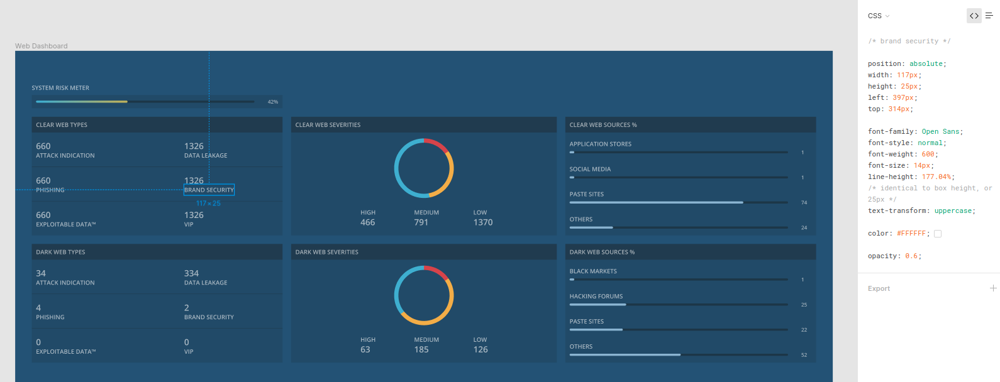

# IntSights challenge

## Main guidelines:
- Build a server side application based on NodeJS + ExpressJS, that will serve the files and the data for the client. You need to understand how to generate the values that will be presented in the dashboard page according to the data we provided in 'server/assets/data.json'.
- Build a dashboard page according to the attached design, using Angular + HTML/CSS.
- When you're done send us a zip file containing the solution.
- The webpage should be pixel perfect like the design.  
- The risk meter should be calculated like so:
    - Use the top 300 results by the most recent date.
    - Each "severity" gets a strength as follows: High - 100, Medium - 70, Low - 40. 
    - Each "type" gets a strength as follows: VIP - 100, AttackIndication - 80, ExploitableData - 60, BrandSecurity - 40, DataLeakage - 20, Phishing - 10.
    - Calculate the "severity" strength grade. For example, if we have 100 results from each severity, the strength grade will be: ((100 * 100 + 100 * 70 + 100 * 40) / 300). 
    - Calculate the "type" strength grade accordingly.
    - The risk meter result is the average between the "severity" and the "type" strength grades (should be between 0 - 100). It should appear in the HTML as a progress bar in a color gradient from blue to red (like in the design).

## The page design:
- Use the link to we've sent you in the mail.
- The design is provided in Figma, which is an interface design application that runs in the browser (similar to Zeplin, Avocode, InvVision etc..), you need to log-in or create a user in Figma in order to see all the details.
- You can use Figma in order to measure distance and extract, CSS properties like color, and font. (Don't use Figma's position properties and it put all element in position absolute).
  
  
   
- The font used is "open sans" (https://fonts.google.com/specimen/Open+Sans?selection.family=Open+Sans)   

## Code standards emphasis:
- Add another README.md with instructions that explain how to run your app, if needed.
- Write the Angular client side in reusable components, and add directives/services if needed.
- Write clean code:
    - Do not leave unused lines, files and folders.
    - Do not leave debugging code.
    - Use conventional guidelines (http://www.w3schools.com/js/js_conventions.asp).
    - You can use any external server/client side library that will help you build a better application.
    - Make sure your code works on a clean environment.
    - Make sure the webpage works on the latest versions of Chrome, Explorer and Firefox.
    - It is recommended to use a linting tool that will validate the code standards.

## Bonuses (*if you have time):
- Make the dashboard page as responsive as possible.
- Add CSS animations.
- Put the provided data in a Mongodb instance and pull from the DB.
- Use docker for running the Node/Mongo server.

## Installation server side:
    cd server 
    npm install
    
## Run server
    npm start

## Installation client side:
    npm install -g @angular/cli
    cd client
    npm install

## Run client dev server
    ng serve
